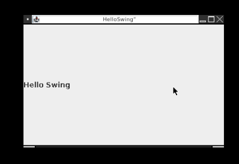
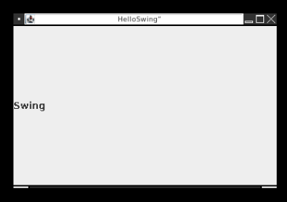
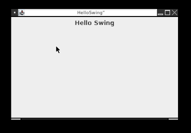

# Introduction

This is a simple tutorial for using Java **AWT** and **Swing**.

I don't introduce **Java**.

When following the examples, try to type and run the code yourself. It will help the learning process.

# Tutorial

## Hello Java

### Basic empty program

All java programs need at least one **main()** function. It is where all execution starts.

```java
public class Main
{
    public static void main(String... args)
    {
    }
}
```

### Saying hello

The simplest way to get output from a program is printing to a console.

```java
public class Main
{
    public static void main(String... args)
    {
        System.out.println("Hello");
    }
}
```

## Hello Swing

Graphics programs (which use buttons, pics, etc...) rarely send output to a console.

What we want is a **window** with a string of **text**.

In swing:

- A **window** is called a **JFrame**

- A **text** object is a **JLabel**

### Basic JFrame

First, let's try to open a window.

We make a new **JFrame** by giving it a **String** title. This will be what's displayed in the *titlebar*;

```java
import javax.swing.*;

public class Main
{
    public static void main(String... args)
    {
        var frame = new JFrame("Frame"); // Line A
    }
}
```

Note: **JFrame** is part of the **javax.swing** package, so we need to import it first to use it.

Note 2: using **var** is the same as using **JFrame**.

Note 3: **var** will cause errors on really old versions of Java, but I don't think you would be using those anyway.

```java
// These are the same!
JFrame frame = new JFrame("Frame");
var frame = new JFrame("Frame");
```

Using **var** means I only type **JFrame** once.

Anyway, this code is not enough. To display the frame properly, we need to do two more things:

1) Give the JFrame a *size* with **setSize(...)**

```java
setSize(480, 360); // Line B
```

2) Make it *visible* on-screen with **setVisible(...)**

```java
setVisible(true); // Line C
```

**Line B** gives the window a size of 480x360 pixels.

**Line C** finally makes the window visible.

Add the two lines after Line A and the basic window program is complete.

### Hello Swing

Now that we can open a JFrame, let's "print" a message.

As mentioned before, we need a **JLabel**.

```java
var label = new JLabel("Hello Swing");
```

We only *created* the label. We also need to *display* it, so we **add** it to the frame.

```java
frame.add(label);
```

The full working Hello Swing code:

```java
import javax.swing.*;

public class Main
{
    public static void main(String... args)
    {
        var frame = new JFrame("Frame");

        var label = new JLabel("Hello Swing");

        frame.add(label);

        frame.setSize(480, 360);
        frame.setVisible(true);
    }
}
```

### Bonus Round

There are two more things to set to complete our program:

1) Show the frame in the center of the window.

2) Exit the program when you click the close button.

These are the two lines to add:

```java
frame.setLocationRelativeTo(null); // (1)
frame.setDefaultCloseOperation(frame.EXIT_ON_CLOSE); // (2)
```

Code for this example: src/HelloSwing.java



## Layouts

**Layouts** tell a frame how to position components (buttons, panels, etc...).

Do we want them:

- side by side?

- left to right?

- top to bottom?

- in a table?

Layouts can do any of these.

### No Layout

Let's *not* use a **Layout** to see what happens.

```java
var label1 = new JLabel("Hello");
var label2 = new JLabel("Swing");

frame.add(label1);
frame.add(label2);
```

If you run this, only **label2** "World" will be displayed.

This is because the *default* layout is **BorderLayout** which (to keep it simple) only shows **one** item at a time when you **frame.add(...)** items.

Code for this example: src/NoLayout.java



### Flow Layout

Let's display the labels **side by side**.

First, we import AWT packages that contain Layout classes:

```java
import java.awt.*;
```

Note: every project using layouts needs to import **java.awt** packages.

Second, we **create** the layout, then we **set** the frame's layout.

```java
var layout = new FlowLayout();

frame.setLayout(layout);
```

If you want to center the items, change the code like this:

```java
var layout = new FlowLayout( FlowLayout.CENTER );
```

There is also:

- **FlowLayout.LEFT**

- **FlowLayout.RIGHT**

Change the code to see the difference.

Code for this example: src/SwingFlow.java



### Box Layout

This layout places items in a line from **left to right** or **top to bottom**.

- **Left to right** uses **BoxLayout.X_ALIGN**

- **Top to bottom** uses **BoxLayout.Y_ALIGN**

The constructor is a bit special. Here is a *left to right* example:

```java
var layout = new BoxLayout( frame, X_ALIGN );

frame.setLayout(layout);
```

Basically, items placed **left to right** are **aligned on the x-axis**, while items placed **top to bottom** are **aligned on the y-axis**.

Thus, **X_ALIGN** and **Y_ALIGN**.

### Grid Layout

This layout places items in a table-like grid.

The following snippet creates a **2x2 grid**. Two spaces (**columns**) left to right, and two spaces (**rows**) top to bottom.

```java
var layout = new GridLayout( 2, 2 );
```

The number of **rows** and **columns** don't have to be equal:

```java
var layout = new GridLayout( 3, 10 );
```

```java
var layout = new GridLayout( 100, 47 );
```

## Input and Interactivity

A HelloWorld console app is both boring and useless since it only displays output. There is no interaction with the user.

### Hello Scanner

In console apps, interaction is achieved with a **Scanner**. Specifically, a **keyboard** scanner.

```java
import java.util.*;

public class Main
{
    public static void main(String... args)
    {
        System.out.print("Enter your name: ");

        var scanner = new Scanner(System.in);

        var name = scanner.nextLine();

        scanner.close();

        System.out.println("Hello, " + name);
    }
}
```

For the most part, the **Scanner** is the only way to interact with users in **console** apps.

But GUI apps have many ways of interaction.

### JButton

Making a **click**able button is simple:

```java
var button = new JButton("Click Me");
```

The String you give it will be the button's text.

### JTextField

A **JTextField** is a textbox that accepts keyboard input when you click in it.

```java
var textField = new JTextField();
```

## JPanel
**Panels** group items together. You can add buttons, textfields and even other panels to a panel.

```java
var b = new JButton("Click Me");
var t = new JTextField();
var p = new JPanel();

var panel = new JPanel()
panel.add(b);
panel.add(t);
panel.add(p);
```

But this code has a problem, similar to a problem with **JFrame**: the default layout is **BorderLayout**.

Meaning: only the **last** item will be displayed.

The obvious solution is to set the panel's layout.

This example displays the previous three items from **top to bottom**:

```java
var layout = new BoxLayout( panel, Y_ALIGN );

panel.setLayout( layout );
```

The panel **p** might look invisible, but it is there.
